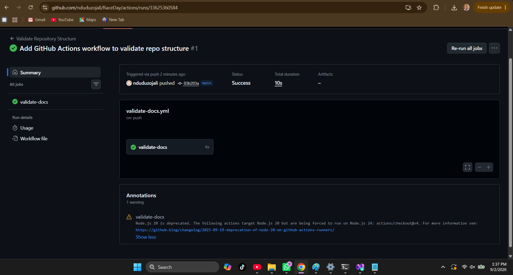

# RaceDay

## Description
RaceDay is a full-stack web-based event management system designed for the South African road running, walking, and cycling community. The platform allows Event Organisers to create and manage events, categories, and participant results, while Participants can browse events, enter events, and track their personal performance history.

This repository currently contains **Part 1: System Planning and Database** — the ERD, API endpoint plan, and SQL database script for the system.

## Roles
The system supports two distinct user roles:

- **Organiser** – can create, edit, and delete events, manage event categories, capture participant results, and view all event enrolments.
- **Participant** – can create an account, browse events, enter an event by selecting a category, view their own enrolments, and track their personal results.

## Repository Structure
```
/docs
  ├── ERD.pdf              # Entity Relationship Diagram
  ├── EndpointPlan.md      # API endpoint specification table
  └── RaceDay_Schema.sql   # SQL Server database creation + seed script
```

## Database Script
The SQL script in `/docs/RaceDay_Schema.sql` creates all 6 entities (User, Event, Category, Enrolment, Result, Payment) with primary keys, foreign keys, and constraints, and seeds the database with sample data (2 Organisers, 2 Participants, 3 Events, categories, and enrolments). It has been tested to run without errors on a clean SQL Server instance in SSMS.

## CI/CD
A GitHub Actions workflow validates that the `/docs` folder exists and contains the required files on every push.

**Build status screenshot:**



## Video Walkthrough
[Watch Part 1 Walkthrough](https://youtube.com/shorts/yLK2ZqR84qA?si=eVCc81xRQl7mmzBF)

## AI Tool Disclosure
AI tools were used during the planning process to assist with structuring the ERD, endpoint plan, and SQL script, as well as troubleshooting Git/GitHub setup steps. All planning decisions and final content were reviewed and understood by the author.